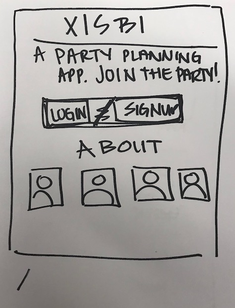
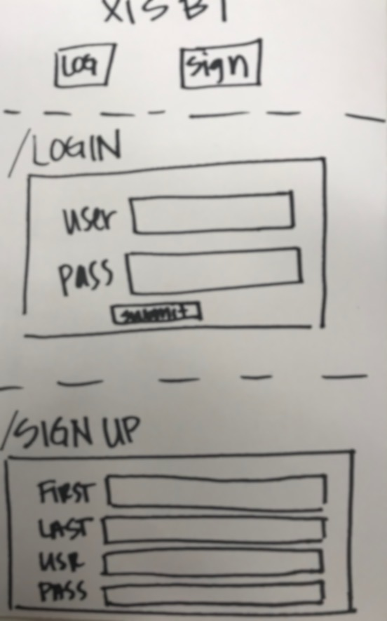
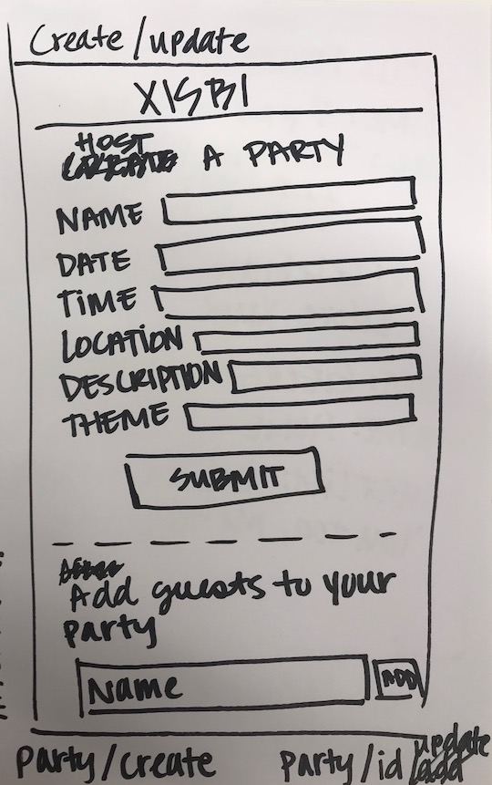
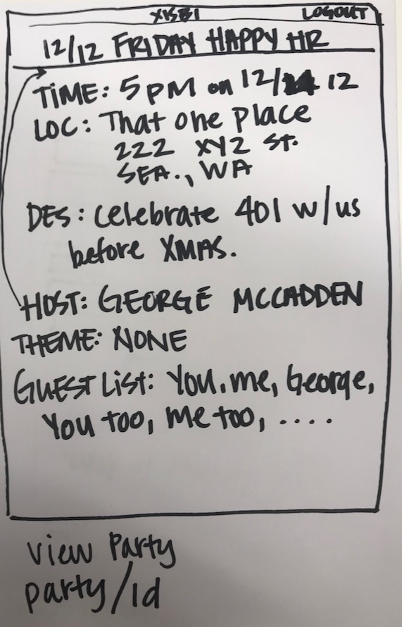
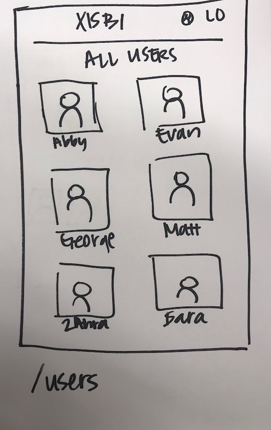

# Wire Frames for XISBI

## Database schemas
- a table for `AppUser` has `firstName`, `lastName`, `username`, `password`, set of `Hosting` parties, set of `Attending` parties.
- a table for `Party` has `host`, `partyName`, `theme`, `location`, `date`, `time`, `description`, and a set of `guestList`.
- a join table for those `attending_party` with a `user`, `party`, *`response`

## Home Page (/)

## Login/Signup Page (/login)

## User Profile Page (/myprofile)

## Create/Update Page for a Party (/party/create, /party/{id}/update)

## View Party Page (/party/{id})

## Users Page (/users)

